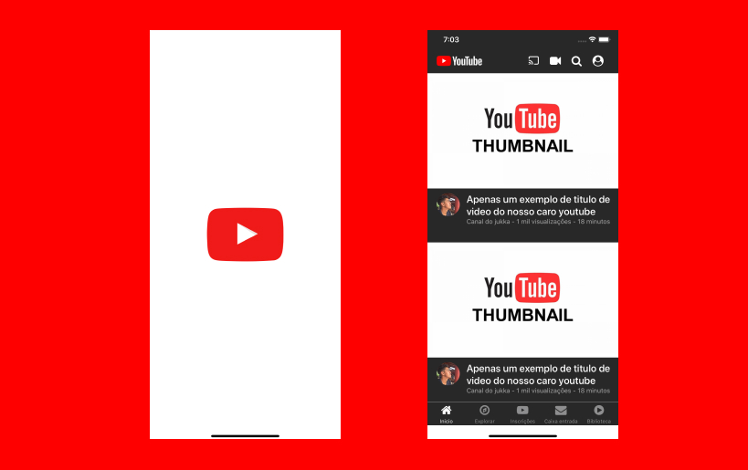

<h1 align="center">
🔥 Youtube
</h1>

A project made in React-Native reproducing the Youtube interface

  

 
  

    
    

    

## Features

This app features all the latest tools and practices in mobile development!

- ⚛️ **React-Native** — A JavaScript library for building user interfaces
- 💅 **Styled-Components** - To style the interfaces
- ⇄ **React-Navigation** - To navigate between screens

## Getting started

1. Clone this repo using `git@github.com:jukka10/Youtube-clone.git`
2. With the open project, Run `yarn` to install dependencies 
3. Run `yarn android` or `yarn ios` to start the project

## License

Thi
